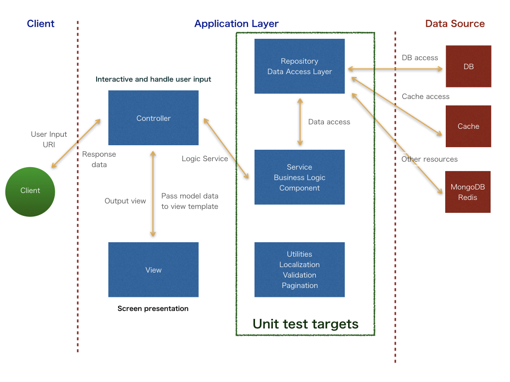

# Basic concepts

## MVC (Model-View-Controller) design pattern
> MVC consists of three kinds of objects. The Model is the application object, the View is its screen presentation, and the Controller defines the way the user interface reacts to user input.
>
> -- <cite>Design Patterns: Elements of Reusable Object-Oriented Software</cite>

## Framework architecture


# How-To

## Tutorial
[http://dnu-development.blogspot.jp/2017/06/how-to-develop-php-application-1-setup.html](http://dnu-development.blogspot.jp/2017/06/how-to-develop-php-application-1-setup.html)  
[http://dnu-development.blogspot.jp/2017/06/how-to-develop-php-application-1-mysql.html](http://dnu-development.blogspot.jp/2017/06/how-to-develop-php-application-1-mysql.html)  
[http://dnu-development.blogspot.jp/2017/06/how-to-develop-php-application-3-php.html](http://dnu-development.blogspot.jp/2017/06/how-to-develop-php-application-3-php.html)  


## How to run on localhost
```
$ ./bin/server -p 12345
# then access on web browser.
```

## How to setup server configuration
1. Install php, apache2, mysql, etc.
```
$ sudo aptitude update
$ sudo aptitude install php apache2 libapache2-mod-php php-pdo, php-mbstring ( ..and so forth.)
```

2. Setup web server  

* In case of Apache2.4  
Set document root as public directory of the framework.
```
<VirtualHost *:80>
    ServerAdmin webmaster@localhost
    # set document root as public directory.
    DocumentRoot /home/minph/git/minph-github/public
    # any name is ok.
    ServerName local-minph.com

    <Directory /home/minph/git/minph-github/public>
        Options Indexes FollowSymLinks
        AllowOverride All
        Require all granted
    </Directory>

    # set log file directory
    ErrorLog ${APACHE_LOG_DIR}/error.log
    CustomLog ${APACHE_LOG_DIR}/access.log combined
</VirtualHost>
```

3. Update composer
```
$ bin/install
```

## How to make controller
1. Create controller class you need  
`app/controller/UserController.php`
```
<?php

class UserController
{
    public function index($request, $tag)
    {
        echo "Hello world.";
    }
}
```

### Note
`$request` contains
'uri'    => (string)  
'method' => (string)  
'header' => (array)  
'input'  => (array)  

`$tag` contains exception information.


2. Link Controller to a routing definition  
`app/routes.php`
```
<?php

return [
    '/' => 'UserController@index'
];
```

## How to make view
1. Select template library (Smarty, Mustache, etc.)
2. Setup template engine by creating a class which implements `Template` interface  
`app/template/TemplateSmarty.php`
```
<?php

use Minph\View\Template;


class TemplateSmarty implements Template
{
    private $engine;

    public function __construct()
    {
        $this->engine = new Smarty();
        $this->engine->setTemplateDir(APP_DIR . '/view');
        $this->engine->setCompileDir(APP_DIR . '/storage/template/smarty/templates_c');
        $this->engine->setCacheDir(APP_DIR . '/storage/template/smarty/cache');
        if (getenv('DEBUG') === 'true') {
            $this->engine->debugging = true;
        }
    }

    public function view($file, $model)
    {
        if (!empty($model)) {
            $this->engine->assign($model);
        }
        $this->engine->display($file);
    }
}
```

3. Prepare template file (depends on template engine.)  
`app/view/index.tpl`
```
Hello, {$name}.
```

4. Register template engine into app  
`app/boot.php`
```
App::setTemplate(App::make('template', 'TemplateSmarty'));
```
>Notice: To generate class on app directory, just call ```App::make($directoryName, $className);```.

5. Call template engine  
`app/controller/UserController.php`
```
<?php

use Minph\View\View;

class UserController
{
    public function index()
    {
        $model = [
            'name' => 'Minph'
        ];
        View::view('index.tpl', $model);
    }
}
```

## Think about model
>An array in PHP is actually an ordered map. A map is a type that associates values to keys. This type is optimized for several different uses; it can be treated as an array, list (vector), hash table (an implementation of a map), dictionary, collection, stack, queue, and probably more. As array values can be other arrays, trees and multidimensional arrays are also possible.
>
> -- <cite>[PHP Manual (http://php.net/manual/en/language.types.array.php)](http://php.net/manual/en/language.types.array.php)</cite>

So minph framework doesn't create any model object.

## How to make Locale
[Locale](./Locale.md)

## How to make validation
[Validation](./Validation.md)


## Class API
[Class API](./CLASS_API.md)
